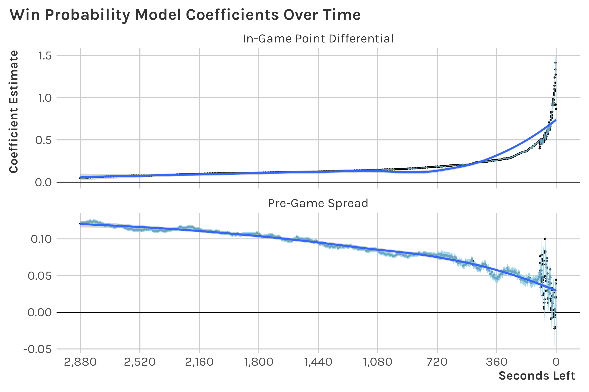

Responses
================

# Q1

I started by identifying what I would use for my data source. I usually
use the [`{nbastatR}` package](https://github.com/abresler/nbastatR) for
NBA related analysis, but I found that the [`{hoopR}`
package](https://github.com/saiemgilani/hoopR) already had data scraped
and includes pre-grame Vegas spreads, which I was interested in
incorporating. I’ll note that the `{hoopR}` package seems to have
seconds remaining reported incorrectly—the max
`start_game_seconds_remaining` in the raw data is 2520, but it should be
2880 (60 \* 48)—so I had to correct this.

I decided to use the 2019-20 and 2020-21 regular season and 2019-20
playoffs for training data, and the 2020-21 playoffs for test data. Of
course more data would make the model better, but two season’s worth of
data seemed to be sufficient for this purpose. I suppose the impact of
the pandemic could be something to worry about. (Perhaps the 2019-20
games are not quite as “representative”.)

Next, I did a relatively quick “literature review” to identify model
frameworks that might be worth trying and features I might want to
investigate.[1] From what I can tell, there are two pretty well-known
public NBA win probability models:

1.  [inpredictable (Mike
    Beouy)](https://www.inpredictable.com/2015/02/updated-nba-win-probability-calculator.html)
2.  [Gambletron2000 (Todd
    Schneider)](https://www.gambletron2000.com/about)

I’m also aware of two other win probabilities models for basketball.

1.  [Luke Benz’s model for college
    basketball](https://github.com/lbenz730/Senior-Thesis/blob/master/luke_benz_senior_thesis.pdf)
2.  [Andrew Patton’s tutorial for the
    NBA](https://github.com/anpatton/basic-nba-tutorials/blob/main/win_probability/make_win_probability_model.md),
    which seems to be somewhat inspired by [Ben Baldwin’s approach for
    the
    NFL](https://www.opensourcefootball.com/posts/2020-09-28-nflfastr-ep-wp-and-cp-models/)
    (both use xgboost)

I chose to adopt Benz’s model 0 approach. [2][3]

1.  **It is relatively straightforward.** In particular, it doesn’t
    require me to parse out things like fouls and timeouts, which
    wouldn’t have been hard, but would have required more time spent.
2.  **It doesn’t require hyper-parameter tuning** (since it’s just
    logistic regression and LOESS coefficients).
3.  **It guarantees symmetry.** (i.e. If the home team has x% win
    probability at time t, the away team is guaranteed to have 100-x%
    win probability at the same time). To do this, I repeat all data
    records twice, once from the perspective of each team.
4.  **The code is available to use as a reference.**

This approach just is based upon 3 factors:

1.  game time (seconds remaining in the game)
2.  score differential
3.  pre-game spread

Notably, (2) and (3) are explicit model inputs, and (1) is implicit.
What do I mean by this? 443 logistic regression models for discrete time
intervals were fit, and a single LOESS model was fit to smooth
coefficients from these overlapping discrete time intervals. Note that
the discrete intervals have longer durations for earlier in the game,
and smaller for later. The decreasing time duration for later game
situations is intended to capture the higher volatility in late game
situations.

One major thing might seem missing from my model—an indicator for home
court advantage. Well, a home court advantage indicator is not needed
because I assume the pre-game spread accounts for home court advantage.
Relying on pre-game spread to tell us something about home advantage is
particularly nice since it seems that [home court advantage has
decreased over
time](https://www.theringer.com/2021/6/1/22462636/what-happened-to-home-court-advantage).
If we were to have an explicit feature for home court advantage, we
would have to account for this downward trend with an additional feature
such as season.

Note that the pre-game spread is also advantageous because it factors in
relative team strength and injuries, so we don’t need additional
features to account for these things.

Due to the nature of the model, there isn’t a single model formula that
I can print out. Nonetheless, the following shows how the weights for
the explicit features for score differential and pre-game spread vary
across the game. [4]



This shows us what we should expect—point differential is more
predictive at the end of the game, and pre-game spread is more
predictive at the beginning of the game.

I computed log loss (`ll`), mean squared error (`mse`), and
misclassification rate (`rate`) for both training and test sets. I was
mostly looking to see that the numbers are similar across the two sets.
(This is basically a check for over-fitting.)

``` r
# # A tibble: 2 x 5
#   set         n    ll   mse misclass_rate
#   <chr>   <dbl> <dbl> <dbl>         <dbl>
# 1 train 2228960 0.460 0.152         0.229
# 2 test    82882 0.456 0.150         0.216
```

My log loss is higher (“worse”) than what Benz shows.[5] Among other
things, my higher log loss could be due to less training data and higher
parity in the NBA (relative to college basketball).

That’s great and all, but we should check how these vary over the course
of a game.


We see that the log loss, mean squared error, and the misclassification
rate are higher at the beginning of the game, when we have less
information about the nature of the game. This matches what we should
have expected.

There are more ways to do calibration analysis, such as measuring
“observed” vs. estimated win probability. [as
so](https://statsbylopez.files.wordpress.com/2017/03/locknett.png?w=569&h=563).
However, in the sake of time, I did not do that.

# Q2


The chart above shows win probability in the top pane and score margin
the bottom pane as a function of game time. I’ve annotated the win
probability at 5:40 left in Q2, as requested. Win probabilities from
public models for the specified time point are noted in a caption for
reference. Win probability and score margin are taken from one team’s
perspective (in this case, the winning team, Milwaukee) in order to
simplify the illustration. There is symmetrical data for Atlanta, but it
is redundant.

Each “step” comes with a new score (not with every minute, or some other
measure of time).

I like showing the scoring margin in a supplementary panel to
contextualize the win probability. Note that a team can be winning in
score, but losing in terms of win probability, such as is the case with
the annotated point. The pre-game spread (4.5 favoring Milwaukee) is
likely the factor that is influencing the win probability to show that
Milwaukee is more likely to win despite being down at that point in the
game.

I choose color selectively to emphasize the teams.

I chose not to do an interactive chart simply because that would take
more time and I’m not sure the extra insight that might be gained
justifies the effort (since this is just a test). In an actual real
world situation, I think I would opt to do something interactive, as is
done on ESPN, inpredictable, and gambletron2000.

# Q3

Player awareness and intangibles are maybe not unexplored concepts—I
think basketball IQ attempts to quantify these things–but I think there
could certainly be more research for them. In particular, I would be
interested in studying the concept of “scanning”, an action where a
player visually gathers information by looking away from the ball before
subsequently engaging with the ball. [A recent study by Jorden et
al.](https://www.ncbi.nlm.nih.gov/pmc/articles/PMC7573254/) found that
Premier League midfielders tend to complete passes at a higher rate if
they scan before receiving the ball and making the pass. I’m curious if
we would find the same in basketball. If so, it could be something that
is emphasized more and more in practice (if it isn’t already).

Regarding data collection (a), we would need to use a combination of
computer vision and pose capturing software, such as in the approach
discussed by [Neil Johnson at the 2019
NESSIS](https://www.youtube.com/watch?v=tvVXl0f45Rc).

Regarding the analysis itself (b), I would begin by using a Bayesian
hierarchal model (probably with [STAN](https://mc-stan.org/)). Such an
approach would be good for accounting for individual player skill
differences (height, nominal position, etc.) and pass difficulty, as
noted by Jorden et al. By accounting for these possibly confounding
factors, I would be able to isolate the effect of scanning on subsequent
pass success.

# Q4

I currently work full time. I would leave my current job and work full
time with SIS if given the opportunity (assuming I can work remotely).

[1] To be clear, I was aware of win probability models and what they
generally incorporate, e.g point differential, but I hadn’t really
investigated the details before.

[2] I realize the prompt says “Your work must be original”. I don’t
really feel like I’m violating this rule. I feel like basing my work on
existing research is valid.

[3] It is similar to Mike Beouy’s. Beouy’s also accounts for possession,
which can be helpful for distinguishing slight changes in win
probability when there are consecutive possessions where there is no
scoring.

[4] This is inspired by Figure 3.1 in Benz’s paper.

[5] See model 0, span=0.5, in Benz’ Figure 3.3.
